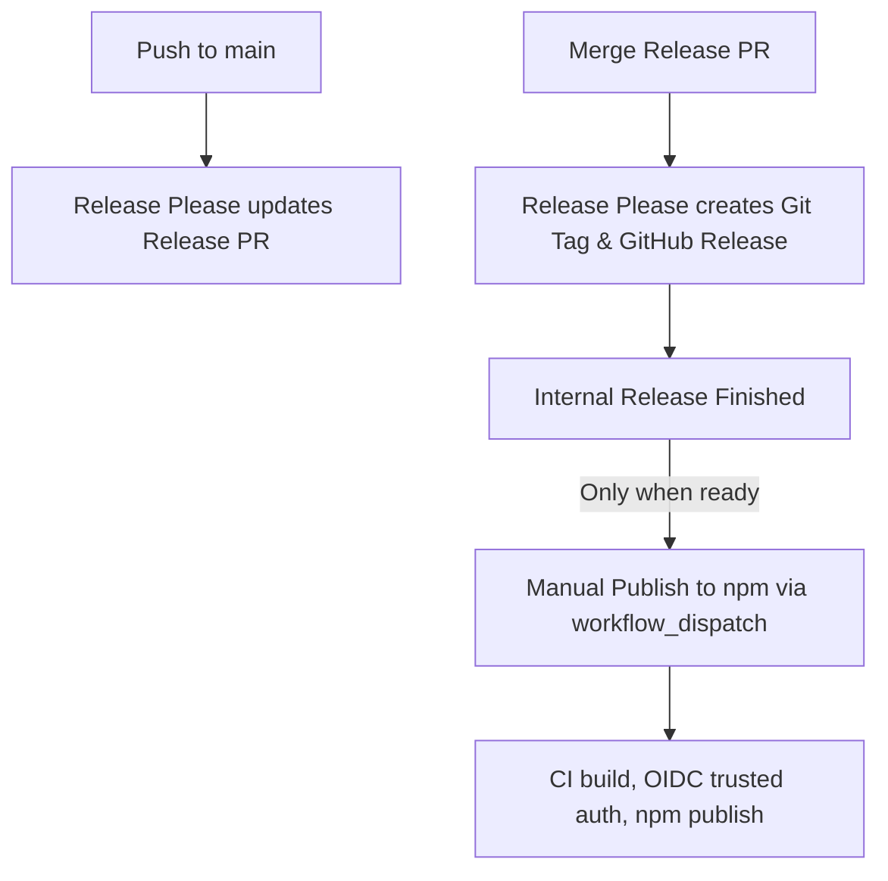

# Norix Release Guide

Norix follows a decoupled release strategy to maintain high code quality and prevent incomplete architecture migrations from flooding the npm registry.

Releases are separated into two distinct phases:

1. **Release Management (Automated via Release Please)**
2. **Package Publishing (Manual Promoted Release)**

---

## The Decoupled Release Architecture

### 1. Internal Releases (Automated)

Every time a pull request is merged into `main`, GitHub Actions triggers the [Release Please](https://github.com/googleapis/release-please-action) workflow (`release.yml`).

- It parses Conventional Commits since the last tag.
- It automatically creates or updates a pending **Release PR** that increments the version and generates `CHANGELOG.md` updates.
- When a maintainer merges the **Release PR**, Release Please creates:
  - A new git tag (e.g. `v1.5.0`)
  - A GitHub Release with generated release notes
- **Crucial Detail**: This internal release does **NOT** publish anything to npm automatically.

### 2. Public npm Releases (Manual promotion)

When a milestone or user-facing update is complete (e.g. migrating core detectors), a maintainer manually promotes a specific internal release tag to npm.

---

## How to Promote a Release to npm

To publish a specific version to the npm registry:

1. Go to the **Actions** tab in your GitHub repository.
2. Select the **Publish to npm** workflow from the left sidebar.
3. Click the **Run workflow** dropdown on the right side.
4. Fill in the parameters:
   - **Use workflow from**: Select `main` (the branch containing the workflow definition).
   - **Git tag to build and publish**: Enter the exact git tag created by Release Please (e.g., `v1.4.0`).
5. Click **Run workflow**.

This workflow checks out the code at that tag, runs full validation checks, and publishes the package to the public npm registry with OIDC Trusted Publishing and build provenance.

---

## Decoupled Authentication & Security

Our publishing workflow uses **OIDC Trusted Publishing** (provenance-based publishing) to exchange short-lived tokens with `npmjs.com`, removing the need for long-lived static tokens stored as secrets.

To authorize the publishing workflow on npm:

1. Go to your package settings on [npmjs.com](https://www.npmjs.com/).
2. Select **Settings > Publishing > Trusted Publishers**.
3. Choose **GitHub Actions** and map it to:
   - **GitHub Organization/User**: `sreeragpariyarath`
   - **GitHub Repository**: `norix`
   - **Workflow name**: `publish.yml`
