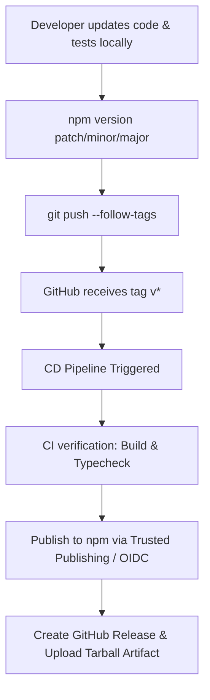

# Automated Release Guide for Norix

This repository uses **GitHub Actions** to automate continuous integration (CI) and continuous delivery (CD). When you push a Git version tag, the pipeline automatically builds, verifies, and publishes the package to npm, and creates a GitHub Release.

---

## How Releases Work

The release pipeline relies on **Git tags**. The pipeline only triggers publishing when a tag matching `v*` (e.g., `v1.0.1`) is pushed to the repository.



---

## How to Cut a New Release

To publish a new version, follow these steps:

### 1. (Recommended) Deploy via single command
Use `npm version` which increments the version in `package.json` and creates a matching Git tag, then push both to GitHub:

```bash
# Automate version bump (patch, minor, or major) and push tags
npm version patch -m "Release %s" && git push --follow-tags
```
*Note: `--follow-tags` pushes both the new commits and the new tag in a single push.*

---

## Automated npm Publishing Methods

Our CD pipeline supports two methods of authentication with the npm registry:

### Method A: Trusted Publishing (OIDC) — *Recommended & Secure*
Trusted Publishing uses OpenID Connect (OIDC) to authenticate GitHub Actions directly with npm. This completely eliminates the need for long-lived, high-privilege npm tokens stored in your repository settings.

#### How it works:
1. When the workflow runs, GitHub issues a short-lived OIDC token.
2. The `npm publish` command exchanges this token with npm.
3. npm validates that the token originates from the correct GitHub repository, branch, and workflow filename.
4. If valid, npm authorizes the publish with a build provenance certificate.

### Method B: Traditional Secret Token (`NPM_TOKEN`) — *Fallback*
If Trusted Publishing is not configured, the workflow looks for a repository secret named `NPM_TOKEN`. It configures your npm registry token locally during the run and publishes the package.

---

## Repository & GitHub Configuration

To make this pipeline work, configure the following settings in your GitHub repository:

### 1. Workflow Permissions
Go to **Settings > Actions > General > Workflow permissions** and ensure:
* **Read and write permissions** is selected (required for the release job to write release details and upload `.tgz` assets).
* **Allow GitHub Actions to create and approve pull requests** (optional, but useful for other automations).

### 2. Configure npm Trusted Publishing (OIDC)
1. Log in to your account on [npmjs.com](https://www.npmjs.com/).
2. Navigate to the **norix-cli** package settings.
3. Go to **Settings > Publishing > Trusted Publishers** (or navigate directly to "Add a publisher").
4. Choose **GitHub Actions** and fill in the details:
   * **Owner**: `sreeragpariyarath` (case-sensitive)
   * **Repository**: `norix` (case-sensitive)
   * **Workflow filename**: `release.yml`
5. Save. The CD pipeline is now authorized to publish without any password or token secrets!

### 3. Fallback: NPM_TOKEN (Optional)
If you prefer not to use OIDC, generate a new Classic Automation Token from npm and add it to your GitHub Repository:
1. Go to **Settings > Secrets and variables > Actions** in your GitHub repository.
2. Click **New repository secret**.
3. Name: `NPM_TOKEN`
4. Value: Paste your npm access token.

### 4. Branch Protection Recommendations
To guarantee repository stability and prevent broken releases, establish branch protection rules for `main`:
1. Navigate to **Settings > Branches**.
2. Under **Branch protection rules**, click **Add rule**.
3. Branch pattern: `main`
4. Enable:
   * **Require a pull request before merging** (forces review).
   * **Require status checks to pass before merging** — search for and select:
     * `Build · Node 22`
     * `Smoke Tests · ubuntu-latest · Node 22`
     * `TypeScript latest`
   * **Require branches to be up to date before merging**.

---

## Troubleshooting Guide

### 1. Job fails at publishing with `403 Forbidden` or `404 Not Found`
* **Reason**: OIDC details do not match the config on npmjs.com.
* **Fix**: Ensure your GitHub organization name, repository name, and the release workflow file name (`release.yml`) match exactly (case-sensitive) in both the npm dashboard and GitHub settings.

### 2. Provenance generation fails
* **Reason**: `id-token: write` permission is missing or you are not running in a supported environment.
* **Fix**: Verify that your workflow has the `permissions.id-token: write` block at the workflow or job level.

### 3. Rate limiting / token expiration
* **Reason**: Classic token (`NPM_TOKEN`) expired.
* **Fix**: Rotate the token on npmjs.com and update the `NPM_TOKEN` repository secret in GitHub.

---

## Rollback Procedure

If a published version contains a critical bug:
1. **Deprecate the bad release** on npm immediately so users don't install it:
   ```bash
   npm deprecate norix-cli@1.0.1 "Critical bug found. Please upgrade to latest version."
   ```
2. **Fix the issue** on a hotfix branch.
3. **Cut a new release** using the standard procedure (e.g. `npm version 1.0.2` or next patch). **Never attempt to overwrite or republish the same version number**; npm prevents overwrite publishes for security.
